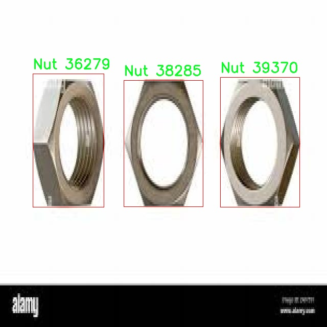

# 机械零件检测检测系统源码分享
 # [一条龙教学YOLOV8标注好的数据集一键训练_70+全套改进创新点发刊_Web前端展示]

### 1.研究背景与意义

项目参考[AAAI Association for the Advancement of Artificial Intelligence](https://gitee.com/qunmasj/projects)

项目来源[AACV Association for the Advancement of Computer Vision](https://kdocs.cn/l/cszuIiCKVNis)

研究背景与意义

随着工业自动化和智能制造的快速发展，机械零件的检测与识别在生产流程中变得愈发重要。传统的人工检测方法不仅效率低下，而且容易受到人为因素的影响，导致检测结果的不稳定性和不准确性。因此，开发高效、准确的机械零件检测系统显得尤为迫切。近年来，深度学习技术的迅猛发展为物体检测领域带来了新的机遇，尤其是YOLO（You Only Look Once）系列模型因其高效的实时检测能力而受到广泛关注。YOLOv8作为该系列的最新版本，结合了更先进的网络结构和算法优化，展现出更高的检测精度和速度。然而，针对特定工业应用场景的YOLOv8模型仍需进行改进和优化，以适应不同类型机械零件的检测需求。

本研究围绕基于改进YOLOv8的机械零件检测系统展开，旨在利用该模型对机械零件进行高效的自动化检测。所使用的数据集包含2600张图像，涵盖了四类机械零件：卡片（Card）、螺母（Nut）、螺钉（Screw）和垫圈（Washer）。这些类别在机械装配和维护中具有重要的应用价值，准确识别和分类这些零件不仅可以提高生产效率，还能降低因零件错误使用而导致的设备故障风险。因此，构建一个高效的检测系统，对于提升生产线的智能化水平、降低人工成本、提高产品质量具有重要的现实意义。

此外，随着制造业向智能化、数字化转型，如何有效地利用数据驱动技术来提升生产效率和产品质量，已成为业界关注的焦点。基于改进YOLOv8的机械零件检测系统，不仅可以为生产线提供实时的检测反馈，还能够通过数据分析实现对生产过程的优化和改进。这种智能检测系统的应用，能够有效降低生产过程中的人为错误，提高生产的自动化程度，推动制造业的转型升级。

本研究的意义还在于推动深度学习技术在工业领域的应用，探索YOLOv8在特定任务中的改进策略。通过对模型进行针对性的优化，研究如何提高其在小样本数据集上的表现，以应对实际生产中可能遇到的多样性和复杂性。这不仅为相关领域的研究提供了新的思路，也为未来的工业应用奠定了基础。

综上所述，基于改进YOLOv8的机械零件检测系统的研究，不仅具有重要的理论价值，还有着广泛的实际应用前景。通过本研究的开展，期望能够为机械零件的智能检测提供新的解决方案，推动工业自动化的发展，为制造业的高质量发展贡献力量。

### 2.图片演示


##### 注意：由于此博客编辑较早，上面“2.图片演示”和“3.视频演示”展示的系统图片或者视频可能为老版本，新版本在老版本的基础上升级如下：（实际效果以升级的新版本为准）

  （1）适配了YOLOV8的“目标检测”模型和“实例分割”模型，通过加载相应的权重（.pt）文件即可自适应加载模型。

  （2）支持“图片识别”、“视频识别”、“摄像头实时识别”三种识别模式。

  （3）支持“图片识别”、“视频识别”、“摄像头实时识别”三种识别结果保存导出，解决手动导出（容易卡顿出现爆内存）存在的问题，识别完自动保存结果并导出到tempDir中。

  （4）支持Web前端系统中的标题、背景图等自定义修改，后面提供修改教程。

  另外本项目提供训练的数据集和训练教程,暂不提供权重文件（best.pt）,需要您按照教程进行训练后实现图片演示和Web前端界面演示的效果。

### 3.视频演示

[3.1 视频演示](https://www.bilibili.com/video/BV1eUsbeFEz2/)

### 4.数据集信息展示

##### 4.1 本项目数据集详细数据（类别数＆类别名）

nc: 4
names: ['Card', 'Nut', 'Screw', 'Washer']


##### 4.2 本项目数据集信息介绍

数据集信息展示

在现代制造业和自动化领域，机械零件的高效检测与识别至关重要。为此，我们构建了一个名为“psio”的数据集，旨在为改进YOLOv8的机械零件检测系统提供强有力的支持。该数据集专注于四种关键的机械零件，分别是卡片（Card）、螺母（Nut）、螺钉（Screw）和垫圈（Washer），这些零件在各类机械装置中广泛应用，其准确识别对于提升生产效率和降低故障率具有重要意义。

“psio”数据集包含了丰富的图像样本，每个类别的样本数量经过精心设计，以确保模型在训练过程中能够充分学习到每种零件的特征。数据集的构建过程中，我们注重样本的多样性和代表性，确保不同光照条件、视角和背景下的零件图像均被纳入考虑。这种多样性不仅提高了模型的鲁棒性，还使其在实际应用中能够更好地适应不同的环境和条件。

在类别划分上，数据集中的四个类别各自具有独特的形状和特征。例如，卡片通常呈现出平坦的矩形外观，边缘清晰，而螺母则是六角形或方形，表面可能有凹槽或其他结构以便于工具的操作。螺钉则具有螺纹和头部设计，通常与其他零件紧密结合，垫圈则用于提供密封和支撑，形状多样，通常是圆形或环形。这些特征的多样性为模型的训练提供了丰富的学习材料，使其能够更准确地进行零件的分类和定位。

为了进一步增强数据集的实用性，我们还进行了数据增强处理，包括旋转、缩放、翻转和颜色调整等操作。这些处理不仅增加了样本的数量，还有效提升了模型的泛化能力，使其在面对未见过的样本时依然能够保持较高的识别准确率。此外，数据集中的每个图像都配有详细的标注信息，包括零件的类别和位置，这为训练和评估提供了必要的基础。

在使用“psio”数据集进行YOLOv8模型的训练时，我们采用了分层抽样的方法，以确保每个类别的样本在训练和验证集中的比例合理。这种方法不仅提高了模型在各类别上的表现，还减少了因类别不平衡导致的训练偏差。通过对模型进行反复训练和调优，我们期望能够显著提升机械零件的检测精度和速度，为工业自动化和智能制造提供更为高效的解决方案。

总之，“psio”数据集的构建和应用为机械零件检测系统的研究提供了坚实的基础。通过对四种关键零件的深入分析和数据集的精心设计，我们希望能够推动YOLOv8在实际应用中的表现，助力于未来智能制造的发展。




### 5.全套项目环境部署视频教程（零基础手把手教学）

[5.1 环境部署教程链接（零基础手把手教学）](https://www.ixigua.com/7404473917358506534?logTag=c807d0cbc21c0ef59de5)


[5.2 安装Python虚拟环境创建和依赖库安装视频教程链接（零基础手把手教学）](https://www.ixigua.com/7404474678003106304?logTag=1f1041108cd1f708b01a)

### 6.手把手YOLOV8训练视频教程（零基础小白有手就能学会）

[6.1 手把手YOLOV8训练视频教程（零基础小白有手就能学会）](https://www.ixigua.com/7404477157818401292?logTag=d31a2dfd1983c9668658)

### 7.70+种全套YOLOV8创新点代码加载调参视频教程（一键加载写好的改进模型的配置文件）

[7.1 70+种全套YOLOV8创新点代码加载调参视频教程（一键加载写好的改进模型的配置文件）](https://www.ixigua.com/7404478314661806627?logTag=29066f8288e3f4eea3a4)

### 8.70+种全套YOLOV8创新点原理讲解（非科班也可以轻松写刊发刊，V10版本正在科研待更新）

由于篇幅限制，每个创新点的具体原理讲解就不一一展开，具体见下列网址中的创新点对应子项目的技术原理博客网址【Blog】：


[8.1 70+种全套YOLOV8创新点原理讲解链接](https://gitee.com/qunmasj/good)

### 9.系统功能展示（检测对象为举例，实际内容以本项目数据集为准）

图9.1.系统支持检测结果表格显示

  图9.2.系统支持置信度和IOU阈值手动调节

  图9.3.系统支持自定义加载权重文件best.pt(需要你通过步骤5中训练获得)

  图9.4.系统支持摄像头实时识别

  图9.5.系统支持图片识别

  图9.6.系统支持视频识别

  图9.7.系统支持识别结果文件自动保存

  图9.8.系统支持Excel导出检测结果数据


### 10.原始YOLOV8算法原理

原始YOLOv8算法原理

YOLOv8作为YOLO系列算法的最新版本，代表了目标检测领域的一次重要进步。其设计理念是将检测速度与精度进行有效平衡，使得该算法在实时应用中表现出色。YOLOv8的网络结构由四个主要部分组成：输入层、Backbone（主干网络）、Neck（特征融合网络）和Head（检测模块）。这一结构的设计不仅考虑了特征提取的有效性，还注重了不同尺度目标的检测能力，充分展现了YOLOv8在多任务处理中的灵活性和高效性。

在输入层，YOLOv8首先对输入图像进行预处理。这一过程包括图像的缩放和比例调整，以适应网络的输入要求。此外，YOLOv8引入了Mosaic增强技术，这种技术通过将多张图像拼接在一起，生成新的训练样本，从而丰富了训练数据的多样性，提升了模型的泛化能力。同时，瞄点计算的引入使得模型在处理复杂场景时能够更好地聚焦于目标，提高了检测的准确性。

Backbone部分是YOLOv8的核心特征提取模块，采用了改进的DarkNet结构。与之前版本不同的是，YOLOv8使用了C2f模块替代了C3模块，C2f模块通过跨层连接增强了梯度流动，改善了特征提取的效果。该模块不仅提高了网络的性能，还保持了轻量级特性，使得YOLOv8在资源受限的环境中依然能够高效运行。Backbone部分由多个CBS模块、C2f模块和一个快速空间金字塔池化（SPPF）模块组成。SPPF模块通过不同内核尺寸的池化操作，融合了多尺度特征图，进一步提升了特征的表达能力。

在Neck部分，YOLOv8采用了双塔结构，将特征金字塔网络（FPN）与路径聚合网络（PAN）相结合。这一设计使得不同尺度的特征图能够有效融合，从而更好地捕捉目标的语义信息和定位信息。通过这种特征融合，YOLOv8能够在不同尺度的目标检测中表现出色，增强了对小目标和大目标的检测能力。此外，Neck部分的设计也促进了特征的传递，确保了信息在网络中的流动更加顺畅。

Head部分是YOLOv8的检测模块，负责最终的目标检测和分类任务。YOLOv8采用了解耦的检测头结构，将回归分支和预测分支进行分离，这一创新设计显著加速了模型的收敛速度，并提高了检测精度。检测头包含多个卷积层和反卷积层，通过并行的卷积分支分别计算目标的位置信息和类别信息。这种解耦结构不仅提高了检测的效率，还使得模型在处理复杂场景时能够更好地应对不同目标的特征。

YOLOv8的训练和部署框架基于Pytorch，使得自定义模型的训练变得更加便捷。该框架支持多种网络结构的选择，包括YOLOv8n、YOLOv8s、YOLOv8m、YOLOv8l和YOLOv8x等。这些不同的网络结构在Backbone的层数和残差块的数量上有所区别，但基本原理相同，均旨在提升目标检测的性能。

综上所述，YOLOv8算法通过其创新的网络结构和特征处理机制，显著提升了目标检测的精度和速度。其在输入处理、特征提取、特征融合和目标检测等各个环节的优化，使得YOLOv8在面对复杂场景时依然能够保持高效的检测能力。这些设计理念和技术创新不仅为YOLO系列算法的发展奠定了基础，也为目标检测领域的进一步研究提供了新的思路和方向。随着YOLOv8的广泛应用，未来的目标检测技术将更加智能化和高效化，推动计算机视觉领域的持续进步。


### 11.项目核心源码讲解（再也不用担心看不懂代码逻辑）

#### 11.1 70+种YOLOv8算法改进源码大全和调试加载训练教程（非必要）\ultralytics\nn\backbone\lsknet.py

以下是对给定代码的核心部分进行提炼和详细注释的结果：

```python
import torch
import torch.nn as nn
from torch.nn.modules.utils import _pair as to_2tuple
from functools import partial

# 定义 Mlp 类，表示多层感知机
class Mlp(nn.Module):
    def __init__(self, in_features, hidden_features=None, out_features=None, act_layer=nn.GELU, drop=0.):
        super().__init__()
        out_features = out_features or in_features  # 输出特征数
        hidden_features = hidden_features or in_features  # 隐藏层特征数
        # 定义两层卷积和一个深度卷积
        self.fc1 = nn.Conv2d(in_features, hidden_features, 1)  # 1x1卷积
        self.dwconv = DWConv(hidden_features)  # 深度卷积
        self.act = act_layer()  # 激活函数
        self.fc2 = nn.Conv2d(hidden_features, out_features, 1)  # 1x1卷积
        self.drop = nn.Dropout(drop)  # Dropout层

    def forward(self, x):
        # 前向传播
        x = self.fc1(x)
        x = self.dwconv(x)
        x = self.act(x)
        x = self.drop(x)
        x = self.fc2(x)
        x = self.drop(x)
        return x

# 定义 LSKblock 类，表示一个特定的块
class LSKblock(nn.Module):
    def __init__(self, dim):
        super().__init__()
        # 定义多个卷积层
        self.conv0 = nn.Conv2d(dim, dim, 5, padding=2, groups=dim)  # 深度卷积
        self.conv_spatial = nn.Conv2d(dim, dim, 7, stride=1, padding=9, groups=dim, dilation=3)  # 空间卷积
        self.conv1 = nn.Conv2d(dim, dim//2, 1)  # 1x1卷积
        self.conv2 = nn.Conv2d(dim, dim//2, 1)  # 1x1卷积
        self.conv_squeeze = nn.Conv2d(2, 2, 7, padding=3)  # 压缩卷积
        self.conv = nn.Conv2d(dim//2, dim, 1)  # 1x1卷积

    def forward(self, x):   
        # 前向传播
        attn1 = self.conv0(x)  # 第一个注意力分支
        attn2 = self.conv_spatial(attn1)  # 第二个注意力分支

        attn1 = self.conv1(attn1)  # 处理第一个分支
        attn2 = self.conv2(attn2)  # 处理第二个分支
        
        # 将两个分支的结果进行拼接
        attn = torch.cat([attn1, attn2], dim=1)
        avg_attn = torch.mean(attn, dim=1, keepdim=True)  # 平均池化
        max_attn, _ = torch.max(attn, dim=1, keepdim=True)  # 最大池化
        agg = torch.cat([avg_attn, max_attn], dim=1)  # 拼接平均和最大池化结果
        sig = self.conv_squeeze(agg).sigmoid()  # 经过卷积后激活
        # 计算最终的注意力
        attn = attn1 * sig[:,0,:,:].unsqueeze(1) + attn2 * sig[:,1,:,:].unsqueeze(1)
        attn = self.conv(attn)  # 最终卷积
        return x * attn  # 输入与注意力相乘

# 定义 Attention 类，表示注意力机制
class Attention(nn.Module):
    def __init__(self, d_model):
        super().__init__()
        self.proj_1 = nn.Conv2d(d_model, d_model, 1)  # 1x1卷积
        self.activation = nn.GELU()  # 激活函数
        self.spatial_gating_unit = LSKblock(d_model)  # 空间门控单元
        self.proj_2 = nn.Conv2d(d_model, d_model, 1)  # 1x1卷积

    def forward(self, x):
        shortcut = x.clone()  # 保留输入用于残差连接
        x = self.proj_1(x)  # 经过第一层卷积
        x = self.activation(x)  # 激活
        x = self.spatial_gating_unit(x)  # 经过空间门控单元
        x = self.proj_2(x)  # 经过第二层卷积
        x = x + shortcut  # 残差连接
        return x

# 定义 Block 类，表示一个完整的块
class Block(nn.Module):
    def __init__(self, dim, mlp_ratio=4., drop=0., drop_path=0., act_layer=nn.GELU):
        super().__init__()
        self.norm1 = nn.BatchNorm2d(dim)  # 第一层归一化
        self.norm2 = nn.BatchNorm2d(dim)  # 第二层归一化
        self.attn = Attention(dim)  # 注意力机制
        self.drop_path = DropPath(drop_path) if drop_path > 0. else nn.Identity()  # 随机丢弃路径
        mlp_hidden_dim = int(dim * mlp_ratio)  # MLP隐藏层维度
        self.mlp = Mlp(in_features=dim, hidden_features=mlp_hidden_dim, act_layer=act_layer, drop=drop)  # MLP

    def forward(self, x):
        # 前向传播
        x = x + self.drop_path(self.attn(self.norm1(x)))  # 注意力层
        x = x + self.drop_path(self.mlp(self.norm2(x)))  # MLP层
        return x

# 定义 LSKNet 类，表示整个网络结构
class LSKNet(nn.Module):
    def __init__(self, img_size=224, in_chans=3, embed_dims=[64, 128, 256, 512], depths=[3, 4, 6, 3]):
        super().__init__()
        self.num_stages = len(embed_dims)  # 网络阶段数
        for i in range(self.num_stages):
            # 每个阶段的嵌入层
            patch_embed = OverlapPatchEmbed(img_size=img_size // (2 ** i), in_chans=in_chans if i == 0 else embed_dims[i - 1], embed_dim=embed_dims[i])
            # 每个阶段的块
            block = nn.ModuleList([Block(dim=embed_dims[i]) for _ in range(depths[i])])
            setattr(self, f"patch_embed{i + 1}", patch_embed)  # 将嵌入层添加到模型中
            setattr(self, f"block{i + 1}", block)  # 将块添加到模型中

    def forward(self, x):
        outs = []
        for i in range(self.num_stages):
            patch_embed = getattr(self, f"patch_embed{i + 1}")
            block = getattr(self, f"block{i + 1}")
            x, H, W = patch_embed(x)  # 嵌入
            for blk in block:
                x = blk(x)  # 经过每个块
            outs.append(x)  # 保存输出
        return outs  # 返回所有阶段的输出

# 定义 DWConv 类，表示深度卷积
class DWConv(nn.Module):
    def __init__(self, dim=768):
        super(DWConv, self).__init__()
        self.dwconv = nn.Conv2d(dim, dim, 3, 1, 1, bias=True, groups=dim)  # 深度卷积

    def forward(self, x):
        return self.dwconv(x)  # 前向传播

# 定义模型构建函数
def lsknet_t(weights=''):
    model = LSKNet(embed_dims=[32, 64, 160, 256], depths=[3, 3, 5, 2])  # 构建模型
    if weights:
        model.load_state_dict(torch.load(weights)['state_dict'])  # 加载权重
    return model

# 主程序
if __name__ == '__main__':
    model = lsknet_t('lsk_t_backbone-2ef8a593.pth')  # 实例化模型
    inputs = torch.randn((1, 3, 640, 640))  # 生成随机输入
    for i in model(inputs):
        print(i.size())  # 打印输出尺寸
```

### 代码核心部分说明：
1. **Mlp 类**：实现了一个多层感知机，包含两个卷积层和一个深度卷积层，使用激活函数和 Dropout。
2. **LSKblock 类**：实现了一个复杂的注意力机制，包含多个卷积层和特征聚合操作。
3. **Attention 类**：实现了一个注意力模块，包含前向传播的残差连接。
4. **Block 类**：组合了注意力模块和 MLP，形成一个完整的网络块。
5. **LSKNet 类**：定义了整个网络结构，包含多个阶段，每个阶段由嵌入层和多个块组成。
6. **DWConv 类**：实现了深度卷积操作，用于特征提取。

这些核心部分构成了一个复杂的神经网络架构，主要用于图像处理任务。

该文件定义了一个名为 `lsknet.py` 的深度学习模型，主要用于图像处理任务。文件中包含多个类和函数，构成了一个复杂的神经网络架构，以下是对其主要组成部分的逐一分析。

首先，文件导入了必要的库，包括 PyTorch 和一些其他模块。接着，定义了一个名为 `Mlp` 的类，这是一个多层感知机模块，包含两个卷积层和一个深度卷积层，使用 GELU 激活函数和 Dropout 进行正则化。该模块的 `forward` 方法定义了数据的前向传播过程。

接下来是 `LSKblock` 类，它实现了一种特殊的块结构，包含多个卷积层和注意力机制。该类通过空间卷积和深度卷积来提取特征，并使用注意力机制来加权不同的特征图，从而增强模型的表达能力。

`Attention` 类则是实现了一个简单的注意力机制，包含两个卷积层和一个空间门控单元。该模块的作用是对输入特征进行变换并结合原始输入，形成残差连接。

`Block` 类结合了归一化、注意力机制和多层感知机，形成了一个完整的网络块。它使用 Batch Normalization 和 DropPath 技术来提高模型的稳定性和性能。

`OverlapPatchEmbed` 类用于将输入图像转换为嵌入特征，使用卷积层来实现图像的分块嵌入，同时进行归一化处理。

`LSKNet` 类是整个网络的主体，包含多个阶段，每个阶段由嵌入层、多个块和归一化层组成。该类的构造函数接收多个参数以定义网络的结构，包括嵌入维度、块的深度等。`forward` 方法则实现了数据的逐阶段前向传播。

`DWConv` 类实现了深度卷积操作，用于在 `Mlp` 类中进行特征提取。

文件中还定义了两个函数 `update_weight` 和 `lsknet_t`、`lsknet_s`，用于加载预训练权重和创建不同版本的 LSKNet 模型。`update_weight` 函数用于更新模型的权重字典，确保加载的权重与模型结构相匹配。

最后，在 `__main__` 块中，示例了如何创建一个 LSKNet 模型实例，并通过随机生成的输入数据测试模型的输出尺寸。

总体来看，该文件实现了一个复杂的深度学习模型，结合了多种现代神经网络设计理念，如注意力机制、深度卷积和残差连接，适用于图像分类或其他视觉任务。

#### 11.2 ui.py

```python
import sys
import subprocess

def run_script(script_path):
    """
    使用当前 Python 环境运行指定的脚本。

    Args:
        script_path (str): 要运行的脚本路径

    Returns:
        None
    """
    # 获取当前 Python 解释器的路径
    python_path = sys.executable

    # 构建运行命令
    command = f'"{python_path}" -m streamlit run "{script_path}"'

    # 执行命令
    result = subprocess.run(command, shell=True)
    if result.returncode != 0:
        print("脚本运行出错。")


# 实例化并运行应用
if __name__ == "__main__":
    # 指定您的脚本路径
    script_path = "web.py"  # 这里可以直接指定脚本路径

    # 运行脚本
    run_script(script_path)
```

### 代码注释

1. **导入模块**：
   - `import sys`：导入系统相关的模块，用于获取当前 Python 解释器的路径。
   - `import subprocess`：导入子进程模块，用于在 Python 中执行外部命令。

2. **定义函数 `run_script`**：
   - 该函数接受一个参数 `script_path`，表示要运行的 Python 脚本的路径。
   - 使用 `sys.executable` 获取当前 Python 解释器的路径，以确保使用正确的 Python 环境来运行脚本。
   - 构建命令字符串，使用 `streamlit` 模块运行指定的脚本。
   - 使用 `subprocess.run` 执行构建的命令，并通过 `shell=True` 允许在 shell 中执行命令。
   - 检查命令的返回码，如果不为 0，表示脚本运行出错，打印错误信息。

3. **主程序入口**：
   - 使用 `if __name__ == "__main__":` 确保只有在直接运行该脚本时才会执行以下代码。
   - 指定要运行的脚本路径为 `web.py`。
   - 调用 `run_script` 函数，传入脚本路径以执行该脚本。

这个程序文件名为 `ui.py`，其主要功能是通过当前的 Python 环境运行一个指定的脚本，具体来说是一个名为 `web.py` 的脚本。程序首先导入了必要的模块，包括 `sys`、`os` 和 `subprocess`，这些模块分别用于访问系统参数、操作系统功能和执行外部命令。

在文件中定义了一个名为 `run_script` 的函数，该函数接受一个参数 `script_path`，表示要运行的脚本的路径。函数内部首先获取当前 Python 解释器的路径，这通过 `sys.executable` 实现。接着，构建一个命令字符串，该命令用于调用 `streamlit` 运行指定的脚本。`streamlit` 是一个用于构建数据应用的库。

随后，使用 `subprocess.run` 方法执行构建好的命令。这个方法会在一个新的进程中运行命令，并且可以通过 `shell=True` 参数来允许使用 shell 特性。执行完命令后，程序会检查返回的状态码，如果状态码不为零，表示脚本运行出错，则打印出相应的错误信息。

在文件的最后部分，使用 `if __name__ == "__main__":` 语句来确保只有在直接运行该文件时才会执行后面的代码。在这部分代码中，调用了 `abs_path` 函数来获取 `web.py` 的绝对路径，并将其传递给 `run_script` 函数以执行该脚本。

总体来说，这个程序的主要目的是为了方便地运行一个特定的 Python 脚本，并在运行过程中处理可能出现的错误。

#### 11.3 code\ultralytics\data\loaders.py

以下是经过简化和注释的核心代码部分，主要保留了视频流加载的功能以及相关类的实现：

```python
import cv2
import numpy as np
from threading import Thread
from pathlib import Path
import time
import math

class LoadStreams:
    """
    视频流加载器，支持多种视频流源，包括RTSP、RTMP、HTTP等。
    """

    def __init__(self, sources="file.streams", imgsz=640, vid_stride=1, buffer=False):
        """初始化视频流加载器，设置视频源和参数。"""
        self.buffer = buffer  # 是否缓冲输入流
        self.running = True  # 线程运行标志
        self.imgsz = imgsz  # 图像大小
        self.vid_stride = vid_stride  # 视频帧率步幅

        # 读取视频源
        sources = Path(sources).read_text().rsplit() if Path(sources).is_file() else [sources]
        n = len(sources)  # 源数量
        self.fps = [0] * n  # 每个源的帧率
        self.frames = [0] * n  # 每个源的总帧数
        self.threads = [None] * n  # 线程列表
        self.caps = [None] * n  # 视频捕获对象列表
        self.imgs = [[] for _ in range(n)]  # 图像列表
        self.shape = [[] for _ in range(n)]  # 图像形状列表
        self.sources = [s.strip() for s in sources]  # 清理源名称

        for i, s in enumerate(sources):
            # 启动线程读取视频流帧
            self.caps[i] = cv2.VideoCapture(s)  # 创建视频捕获对象
            if not self.caps[i].isOpened():
                raise ConnectionError(f"无法打开视频源: {s}")
            self.fps[i] = max(self.caps[i].get(cv2.CAP_PROP_FPS), 30)  # 获取帧率，默认为30
            success, im = self.caps[i].read()  # 读取第一帧
            if not success:
                raise ConnectionError(f"无法读取视频源: {s}")
            self.imgs[i].append(im)  # 存储第一帧
            self.shape[i] = im.shape  # 存储图像形状
            self.threads[i] = Thread(target=self.update, args=(i, self.caps[i], s), daemon=True)
            self.threads[i].start()  # 启动线程

    def update(self, i, cap, stream):
        """在后台线程中读取视频流帧。"""
        while self.running and cap.isOpened():
            if len(self.imgs[i]) < 30:  # 保持缓冲区最多30帧
                cap.grab()  # 抓取下一帧
                success, im = cap.retrieve()  # 获取帧
                if success:
                    self.imgs[i].append(im)  # 添加到图像列表
                else:
                    self.imgs[i].append(np.zeros(self.shape[i], dtype=np.uint8))  # 添加空帧

    def close(self):
        """关闭视频流加载器并释放资源。"""
        self.running = False  # 停止线程
        for thread in self.threads:
            if thread.is_alive():
                thread.join(timeout=5)  # 等待线程结束
        for cap in self.caps:
            cap.release()  # 释放视频捕获对象

    def __iter__(self):
        """返回迭代器对象。"""
        self.count = -1
        return self

    def __next__(self):
        """返回源路径和图像进行处理。"""
        self.count += 1
        if self.count >= len(self.sources):
            raise StopIteration  # 结束迭代

        images = []
        for i in range(len(self.imgs)):
            while not self.imgs[i]:  # 等待帧可用
                time.sleep(0.01)
            images.append(self.imgs[i].pop(0))  # 获取并移除第一帧

        return self.sources, images, None, ""  # 返回源路径和图像

    def __len__(self):
        """返回源数量。"""
        return len(self.sources)  # 源数量
```

### 代码说明：
1. **LoadStreams 类**：负责从多种视频源加载视频流，支持多线程读取。
2. **__init__ 方法**：初始化视频流加载器，读取视频源并启动线程。
3. **update 方法**：在后台线程中持续读取视频帧，确保图像缓冲区有足够的帧。
4. **close 方法**：停止线程并释放资源。
5. **__iter__ 和 __next__ 方法**：实现迭代器协议，允许用户逐帧获取视频流。
6. **__len__ 方法**：返回视频源的数量。 

通过这种方式，用户可以方便地从指定的视频源中获取图像数据，适用于YOLO等计算机视觉任务。

这个程序文件是一个用于加载和处理视频流、图像和截图的模块，主要用于与Ultralytics YOLO（一个流行的目标检测模型）配合使用。文件中定义了多个类，分别负责不同类型的数据加载。

首先，`SourceTypes`类用于表示输入源的类型，包括网络摄像头、截图、图像文件和张量等。接下来是`LoadStreams`类，它负责加载各种类型的视频流，包括RTSP、RTMP、HTTP和TCP流。这个类的构造函数接受源路径和一些参数，如图像大小和视频帧率步幅。它会尝试打开每个视频流，并在后台线程中读取帧。`update`方法在后台线程中不断读取视频帧，并将其存储在一个缓冲区中。`__next__`方法则返回源路径、处理后的图像和原始图像。

`LoadScreenshots`类用于从屏幕捕获截图。它使用`mss`库来实现屏幕捕获，并支持指定捕获区域。该类的`__next__`方法返回捕获的截图。

`LoadImages`类用于加载图像和视频文件。它支持从单个图像文件、视频文件以及图像和视频路径列表中加载数据。构造函数会检查文件是否存在，并根据文件类型进行分类。`__next__`方法返回下一个图像或视频帧。

`LoadPilAndNumpy`类用于从PIL和Numpy数组加载图像，确保图像格式正确并进行必要的转换。`LoadTensor`类则用于从PyTorch张量加载图像，确保输入张量的形状和数值范围符合要求。

最后，`autocast_list`函数用于将不同类型的源合并为Numpy数组或PIL图像的列表，`get_best_youtube_url`函数用于从YouTube视频中提取最佳质量的MP4视频流URL。

整个模块的设计使得用户可以方便地从多种来源加载数据，并进行后续的处理和分析，适用于目标检测等计算机视觉任务。

#### 11.4 70+种YOLOv8算法改进源码大全和调试加载训练教程（非必要）\ultralytics\nn\extra_modules\ops_dcnv3\functions\__init__.py

以下是保留的核心代码部分，并附上详细的中文注释：

```python
# 导入DCNv3Function和dcnv3_core_pytorch模块
from .dcnv3_func import DCNv3Function, dcnv3_core_pytorch

# 这行代码从当前包的dcnv3_func模块中导入了两个重要的功能：
# 1. DCNv3Function：可能是一个自定义的函数或类，用于实现DCNv3（Deformable Convolutional Networks v3）的相关操作。
# 2. dcnv3_core_pytorch：可能是一个核心的PyTorch实现，提供了DCNv3的基础功能或接口。
```

这段代码的核心在于导入DCNv3相关的功能，以便在后续的代码中使用这些功能进行变形卷积的操作。

这个程序文件是一个Python模块的初始化文件，位于一个名为`ops_dcnv3`的目录下，属于YOLOv8算法改进的源码库。文件的开头包含了一些版权信息，表明该代码是由OpenGVLab开发的，并且受MIT许可证的保护。这意味着用户可以自由使用、修改和分发该代码，只要遵循许可证的条款。

在文件的主体部分，使用了`from ... import ...`语句来导入其他模块中的功能。具体来说，它从同一目录下的`dcnv3_func`模块中导入了`DCNv3Function`和`dcnv3_core_pytorch`这两个功能。这表明该模块可能与深度学习中的可微分卷积（Deformable Convolution）相关，DCNv3是一种改进的可微分卷积实现，通常用于提高模型在处理复杂形状和物体时的性能。

总的来说，这个初始化文件的作用是为`ops_dcnv3`模块提供必要的功能导入，使得在其他地方使用该模块时，可以直接访问`DCNv3Function`和`dcnv3_core_pytorch`这两个功能，进而支持YOLOv8算法的相关操作和训练过程。

#### 11.5 code\ultralytics\trackers\byte_tracker.py

以下是代码中最核心的部分，并附上详细的中文注释：

```python
import numpy as np
from .basetrack import BaseTrack, TrackState
from .utils import matching
from .utils.kalman_filter import KalmanFilterXYAH

class STrack(BaseTrack):
    """
    单目标跟踪表示，使用卡尔曼滤波进行状态估计。

    该类负责存储与单个跟踪相关的所有信息，并基于卡尔曼滤波进行状态更新和预测。
    """

    shared_kalman = KalmanFilterXYAH()  # 所有STrack实例共享的卡尔曼滤波器

    def __init__(self, tlwh, score, cls):
        """初始化新的STrack实例。"""
        super().__init__()
        # 将tlwh格式的边界框转换为tlbr格式并存储
        self._tlwh = np.asarray(self.tlbr_to_tlwh(tlwh[:-1]), dtype=np.float32)
        self.kalman_filter = None  # 特定对象跟踪的卡尔曼滤波器实例
        self.mean, self.covariance = None, None  # 状态均值和协方差
        self.is_activated = False  # 跟踪是否已激活的标志

        self.score = score  # 跟踪的置信度分数
        self.tracklet_len = 0  # 跟踪片段的长度
        self.cls = cls  # 对象的类别标签
        self.idx = tlwh[-1]  # 对象的索引

    def predict(self):
        """使用卡尔曼滤波器预测对象的下一个状态。"""
        mean_state = self.mean.copy()  # 复制当前均值状态
        if self.state != TrackState.Tracked:  # 如果状态不是跟踪状态
            mean_state[7] = 0  # 将速度设置为0
        # 使用卡尔曼滤波器进行预测
        self.mean, self.covariance = self.kalman_filter.predict(mean_state, self.covariance)

    def activate(self, kalman_filter, frame_id):
        """启动新的跟踪片段。"""
        self.kalman_filter = kalman_filter  # 设置卡尔曼滤波器
        self.track_id = self.next_id()  # 获取新的跟踪ID
        # 初始化卡尔曼滤波器的状态
        self.mean, self.covariance = self.kalman_filter.initiate(self.convert_coords(self._tlwh))

        self.tracklet_len = 0  # 重置跟踪片段长度
        self.state = TrackState.Tracked  # 设置状态为跟踪状态
        if frame_id == 1:
            self.is_activated = True  # 如果是第一帧，激活跟踪
        self.frame_id = frame_id  # 设置当前帧ID
        self.start_frame = frame_id  # 设置开始帧ID

    def update(self, new_track, frame_id):
        """
        更新匹配跟踪的状态。

        参数:
            new_track (STrack): 包含更新信息的新跟踪。
            frame_id (int): 当前帧的ID。
        """
        self.frame_id = frame_id  # 更新当前帧ID
        self.tracklet_len += 1  # 增加跟踪片段长度

        new_tlwh = new_track.tlwh  # 获取新的tlwh格式边界框
        # 使用卡尔曼滤波器更新状态
        self.mean, self.covariance = self.kalman_filter.update(
            self.mean, self.covariance, self.convert_coords(new_tlwh)
        )
        self.state = TrackState.Tracked  # 设置状态为跟踪状态
        self.is_activated = True  # 激活跟踪

        self.score = new_track.score  # 更新置信度分数
        self.cls = new_track.cls  # 更新类别标签
        self.idx = new_track.idx  # 更新索引

    @property
    def tlwh(self):
        """获取当前边界框位置（左上角x, 左上角y, 宽度, 高度）。"""
        if self.mean is None:
            return self._tlwh.copy()  # 如果均值为空，返回初始值
        ret = self.mean[:4].copy()  # 复制均值的前四个元素
        ret[2] *= ret[3]  # 计算宽度
        ret[:2] -= ret[2:] / 2  # 计算左上角坐标
        return ret

    @staticmethod
    def tlwh_to_xyah(tlwh):
        """将边界框转换为格式（中心x, 中心y, 宽高比, 高度）。"""
        ret = np.asarray(tlwh).copy()  # 复制tlwh格式的边界框
        ret[:2] += ret[2:] / 2  # 计算中心坐标
        ret[2] /= ret[3]  # 计算宽高比
        return ret
```

### 代码核心部分说明：
1. **STrack类**：表示单个目标的跟踪，使用卡尔曼滤波进行状态估计。
2. **属性**：
   - `shared_kalman`：所有STrack实例共享的卡尔曼滤波器。
   - `_tlwh`：存储边界框的左上角坐标和宽高。
   - `mean`和`covariance`：存储状态的均值和协方差。
   - `is_activated`：指示跟踪是否已激活的布尔标志。
3. **方法**：
   - `predict()`：使用卡尔曼滤波器预测下一个状态。
   - `activate()`：激活新的跟踪片段。
   - `update()`：更新匹配的跟踪状态。
   - `tlwh()`：获取当前边界框位置。
   - `tlwh_to_xyah()`：将边界框转换为中心坐标和宽高比格式。 

以上是对代码中核心部分的详细注释和说明。

这个程序文件 `byte_tracker.py` 实现了一个基于 Kalman 滤波器的单目标跟踪算法，主要用于在视频序列中跟踪检测到的对象。它包含两个主要的类：`STrack` 和 `BYTETracker`。

`STrack` 类用于表示单个对象的跟踪状态。它继承自 `BaseTrack` 类，主要负责存储与每个跟踪对象相关的信息，包括边界框的位置、Kalman 滤波器的状态、置信度分数等。该类提供了多种方法来预测对象的下一个状态、更新跟踪状态、激活新跟踪、重新激活丢失的跟踪等。具体来说，`STrack` 使用 Kalman 滤波器来进行状态估计和预测，并提供了将不同格式的边界框进行转换的方法，如从 tlwh（左上角坐标、宽度、高度）到 xyah（中心坐标、宽高比、高度）的转换。

`BYTETracker` 类则是整个跟踪算法的核心，负责管理和更新多个对象的跟踪状态。它维护了三个列表：已跟踪的对象、丢失的对象和已移除的对象。该类在初始化时设置了 Kalman 滤波器和其他参数，并在每一帧中更新跟踪状态。`update` 方法是该类的关键，它接收检测结果并根据这些结果更新跟踪状态，包括激活新跟踪、重新激活丢失的跟踪、处理未确认的跟踪等。

在 `update` 方法中，首先会对检测结果进行处理，筛选出高置信度和低置信度的检测框。接着，利用 Kalman 滤波器预测当前帧中跟踪对象的位置，并通过匈牙利算法进行数据关联，匹配跟踪对象和检测框。然后，更新已匹配的跟踪对象的状态，并处理未匹配的对象，标记为丢失或移除。

此外，`BYTETracker` 还提供了一些辅助方法，例如计算跟踪对象与检测框之间的距离、合并和过滤跟踪对象列表等。这些方法确保了跟踪算法的高效性和准确性。

总的来说，这个文件实现了一个完整的对象跟踪系统，结合了 Kalman 滤波器和 YOLOv8 的检测能力，能够在视频序列中实时跟踪多个对象。

#### 11.6 train.py

以下是经过简化和注释的核心代码部分：

```python
import random
import numpy as np
import torch.nn as nn
from ultralytics.data import build_dataloader, build_yolo_dataset
from ultralytics.engine.trainer import BaseTrainer
from ultralytics.models import yolo
from ultralytics.nn.tasks import DetectionModel
from ultralytics.utils import LOGGER, RANK
from ultralytics.utils.torch_utils import de_parallel, torch_distributed_zero_first

class DetectionTrainer(BaseTrainer):
    """
    基于检测模型的训练类，继承自BaseTrainer类。
    """

    def build_dataset(self, img_path, mode="train", batch=None):
        """
        构建YOLO数据集。

        参数:
            img_path (str): 包含图像的文件夹路径。
            mode (str): 模式，'train'或'val'，用户可以为每种模式自定义不同的增强。
            batch (int, optional): 批次大小，适用于'rect'模式。默认为None。
        """
        gs = max(int(de_parallel(self.model).stride.max() if self.model else 0), 32)  # 获取模型的最大步幅
        return build_yolo_dataset(self.args, img_path, batch, self.data, mode=mode, rect=mode == "val", stride=gs)

    def get_dataloader(self, dataset_path, batch_size=16, rank=0, mode="train"):
        """构造并返回数据加载器。"""
        assert mode in ["train", "val"]  # 确保模式有效
        with torch_distributed_zero_first(rank):  # 在分布式训练中，仅初始化一次数据集
            dataset = self.build_dataset(dataset_path, mode, batch_size)  # 构建数据集
        shuffle = mode == "train"  # 训练模式下打乱数据
        workers = self.args.workers if mode == "train" else self.args.workers * 2  # 根据模式设置工作线程数
        return build_dataloader(dataset, batch_size, workers, shuffle, rank)  # 返回数据加载器

    def preprocess_batch(self, batch):
        """对图像批次进行预处理，包括缩放和转换为浮点数。"""
        batch["img"] = batch["img"].to(self.device, non_blocking=True).float() / 255  # 将图像转换为浮点数并归一化
        if self.args.multi_scale:  # 如果启用多尺度
            imgs = batch["img"]
            sz = (
                random.randrange(self.args.imgsz * 0.5, self.args.imgsz * 1.5 + self.stride)
                // self.stride
                * self.stride
            )  # 随机选择图像大小
            sf = sz / max(imgs.shape[2:])  # 计算缩放因子
            if sf != 1:
                ns = [
                    math.ceil(x * sf / self.stride) * self.stride for x in imgs.shape[2:]
                ]  # 计算新的图像形状
                imgs = nn.functional.interpolate(imgs, size=ns, mode="bilinear", align_corners=False)  # 调整图像大小
            batch["img"] = imgs  # 更新批次图像
        return batch

    def get_model(self, cfg=None, weights=None, verbose=True):
        """返回YOLO检测模型。"""
        model = DetectionModel(cfg, nc=self.data["nc"], verbose=verbose and RANK == -1)  # 创建检测模型
        if weights:
            model.load(weights)  # 加载权重
        return model

    def plot_training_samples(self, batch, ni):
        """绘制带有注释的训练样本。"""
        plot_images(
            images=batch["img"],
            batch_idx=batch["batch_idx"],
            cls=batch["cls"].squeeze(-1),
            bboxes=batch["bboxes"],
            paths=batch["im_file"],
            fname=self.save_dir / f"train_batch{ni}.jpg",
            on_plot=self.on_plot,
        )

    def plot_metrics(self):
        """从CSV文件绘制指标。"""
        plot_results(file=self.csv, on_plot=self.on_plot)  # 保存结果图像
```

### 代码注释说明：
1. **类和方法**：`DetectionTrainer`类用于训练YOLO检测模型，包含多个方法用于数据集构建、数据加载、批处理预处理、模型获取和结果绘制等。
2. **数据集构建**：`build_dataset`方法负责构建YOLO数据集，支持训练和验证模式。
3. **数据加载器**：`get_dataloader`方法根据指定的模式和批次大小返回数据加载器，支持分布式训练。
4. **批处理预处理**：`preprocess_batch`方法对输入图像进行归一化和缩放处理，以适应模型输入。
5. **模型获取**：`get_model`方法创建并返回YOLO检测模型，支持加载预训练权重。
6. **结果绘制**：`plot_training_samples`和`plot_metrics`方法用于可视化训练样本和训练指标，帮助监控训练过程。

这个程序文件 `train.py` 是一个用于训练 YOLO（You Only Look Once）目标检测模型的实现，继承自 `BaseTrainer` 类。文件中包含了一系列用于构建数据集、数据加载、预处理、模型设置和训练过程中的可视化等功能的方法。

首先，程序导入了必要的库和模块，包括数学运算、随机数生成、深度学习框架 PyTorch 相关的模块，以及 Ultralytics 提供的用于数据处理和模型训练的工具。接着，定义了 `DetectionTrainer` 类，该类专门用于基于检测模型的训练。

在 `DetectionTrainer` 类中，`build_dataset` 方法用于构建 YOLO 数据集。它接收图像路径、模式（训练或验证）和批次大小作为参数，使用 `build_yolo_dataset` 函数来创建数据集，支持不同模式下的图像增强。

`get_dataloader` 方法用于构建并返回数据加载器。它根据模式选择是否打乱数据，并设置工作线程的数量。通过 `torch_distributed_zero_first` 方法，确保在分布式训练中只初始化一次数据集。

`preprocess_batch` 方法负责对一批图像进行预处理，包括缩放和转换为浮点数格式。它还支持多尺度训练，通过随机选择图像大小来增强模型的鲁棒性。

`set_model_attributes` 方法用于设置模型的属性，包括类别数量和类别名称，以便模型能够正确处理数据集中的不同类别。

`get_model` 方法返回一个 YOLO 检测模型实例，支持加载预训练权重。

`get_validator` 方法返回一个用于模型验证的 `DetectionValidator` 实例，负责计算损失和评估模型性能。

`label_loss_items` 方法用于返回带有标签的训练损失项字典，便于后续的损失监控和分析。

`progress_string` 方法生成一个格式化的字符串，用于显示训练进度，包括当前的 epoch、GPU 内存使用情况、损失值、实例数量和图像大小等信息。

`plot_training_samples` 方法用于绘制训练样本及其标注，便于可视化训练过程中的数据。

最后，`plot_metrics` 和 `plot_training_labels` 方法分别用于绘制训练过程中的指标和创建带标签的训练图，以便于对模型训练效果的分析和展示。

总体而言，这个文件实现了 YOLO 模型训练的核心功能，涵盖了数据处理、模型构建、训练过程监控和结果可视化等多个方面。

### 12.系统整体结构（节选）

### 整体功能和构架概括

该程序库是一个完整的目标检测框架，基于 YOLOv8 算法，旨在提供高效的模型训练、推理和数据处理功能。它包含多个模块，涵盖了从数据加载、模型构建、训练、验证到可视化的各个方面。程序的架构设计灵活，支持多种输入源和模型改进，使得用户能够方便地进行目标检测任务的开发和调试。

主要模块功能如下：

- **数据加载与处理**：提供了多种数据加载器，支持从图像、视频流、截图等多种源加载数据，并进行必要的预处理。
- **模型定义与训练**：实现了 YOLOv8 模型的构建和训练过程，支持多种训练策略和参数配置。
- **跟踪算法**：实现了基于 Kalman 滤波器的目标跟踪算法，能够在视频序列中实时跟踪多个对象。
- **可视化与监控**：提供了训练过程中的可视化功能，帮助用户监控训练进度和模型性能。

### 文件功能整理表

| 文件路径                                                                                     | 功能描述                                                         |
|----------------------------------------------------------------------------------------------|------------------------------------------------------------------|
| `70+种YOLOv8算法改进源码大全和调试加载训练教程（非必要）\ultralytics\nn\backbone\lsknet.py` | 定义 LSKNet 模型，包括多层感知机、注意力机制和卷积块等。         |
| `ui.py`                                                                                     | 提供了一个界面，用于运行指定的脚本（如 web.py）。                |
| `code\ultralytics\data\loaders.py`                                                          | 实现数据加载器，支持从视频流、图像和截图加载数据。               |
| `70+种YOLOv8算法改进源码大全和调试加载训练教程（非必要）\ultralytics\nn\extra_modules\ops_dcnv3\functions\__init__.py` | 初始化文件，导入可微分卷积（DCNv3）相关功能。                    |
| `code\ultralytics\trackers\byte_tracker.py`                                                | 实现基于 Kalman 滤波器的目标跟踪算法，管理和更新跟踪状态。       |
| `train.py`                                                                                  | 负责 YOLO 模型的训练过程，包括数据加载、模型设置和训练监控。    |
| `70+种YOLOv8算法改进源码大全和调试加载训练教程（非必要）\ultralytics\models\nas\predict.py` | 实现 NAS（神经架构搜索）模型的预测功能。                         |
| `70+种YOLOv8算法改进源码大全和调试加载训练教程（非必要）\ultralytics\models\rtdetr\__init__.py` | 初始化 RTDETR 模型相关功能。                                     |
| `70+种YOLOv8算法改进源码大全和调试加载训练教程（非必要）\ultralytics\models\yolo\segment\train.py` | 实现 YOLO 模型的分割训练功能。                                   |
| `70+种YOLOv8算法改进源码大全和调试加载训练教程（非必要）\ultralytics\utils\files.py`      | 提供文件操作的工具函数，如文件路径处理和文件读写。               |
| `70+种YOLOv8算法改进源码大全和调试加载训练教程（非必要）\ultralytics\data\build.py`      | 构建数据集的工具，支持数据集的预处理和格式转换。                 |
| `code\ultralytics\utils\tuner.py`                                                           | 提供模型超参数调优的工具函数。                                   |
| `code\ultralytics\models\yolo\obb\val.py`                                                  | 实现 YOLO 模型的验证功能，评估模型在验证集上的性能。             |

这个表格总结了每个文件的主要功能，帮助用户快速了解整个项目的结构和各个模块的作用。

注意：由于此博客编辑较早，上面“11.项目核心源码讲解（再也不用担心看不懂代码逻辑）”中部分代码可能会优化升级，仅供参考学习，完整“训练源码”、“Web前端界面”和“70+种创新点源码”以“13.完整训练+Web前端界面+70+种创新点源码、数据集获取”的内容为准。

### 13.完整训练+Web前端界面+70+种创新点源码、数据集获取


# [下载链接：https://mbd.pub/o/bread/ZpuZkp5q](https://mbd.pub/o/bread/ZpuZkp5q)